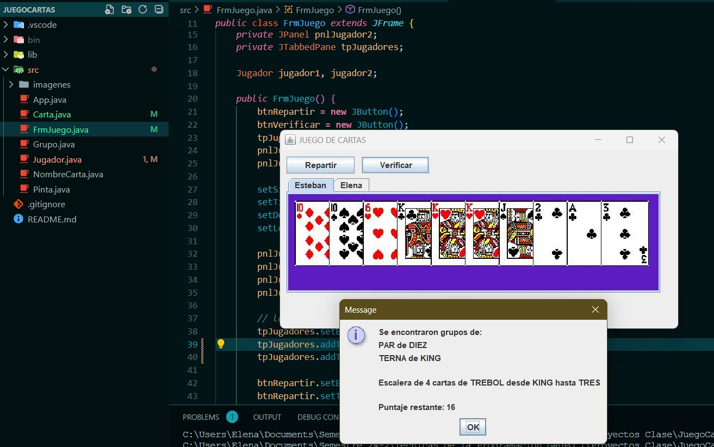

# Juego de Cartas - Apuntado
Este proyecto es una implementación de un juego de cartas basado en la baraja inglesa, denominado "Apuntado", una variante del Rummy (Remis). El objetivo del juego es formar grupos de cartas (pares, ternas, escaleras, etc.) y minimizar el valor de las cartas restantes que no forman parte de ningún grupo.

## Descripción del Juego
En el juego "Apuntado", cada jugador recibe 10 cartas de una baraja inglesa de 52 cartas. Los jugadores deben identificar grupos de cartas, que pueden ser:

- Pares o Ternas: Grupos de cartas con el mismo valor.
- Escaleras: Secuencias de tres o más cartas consecutivas de la misma pinta.
- Las cartas que no forman parte de ningún grupo se consideran "restantes", y su valor numérico cuenta hacia el puntaje final. 
- El jugador con el menor puntaje al final gana la partida.

## Puntuación
* Las cartas numéricas (2 al 10) tienen su valor numérico correspondiente.
* Las cartas con figuras (J, Q, K) valen 10 puntos cada una.
* El As (A) puede valer 1 punto, aunque se podría modificar para valer 11 en ciertas variantes del juego.
* Las cartas que forman parte de grupos (pares, ternas, escaleras) no suman puntos.
* Las cartas no agrupadas se suman para calcular el puntaje total del jugador.

## Características
* Interfaz Gráfica (GUI): El juego cuenta con una interfaz gráfica simple que permite a dos jugadores interactuar, repartir cartas y verificar sus grupos y puntaje.
* Lógica de Agrupación: Los jugadores pueden formar pares, ternas y escaleras. Las cartas que no forman parte de grupos se consideran para calcular el puntaje.
* Soporte para Escaleras Circulares: El juego permite identificar escaleras que van desde el Rey (K) hasta el As (A), simulando un comportamiento circular en la secuencia de cartas.

# Instalación
* Clona este repositorio:

git clone  https://github.com/EleVG26/UDEA_TP_JuegoCartas

* Navega hasta la carpeta del proyecto:
 `cd juego-apuntado`
* Asegúrate de tener configurado el entorno de desarrollo de Java y las bibliotecas necesarias para ejecutar aplicaciones Swing (están incluidas en JDK)
* Compila el proyecto:
`javac *.java`
* Ejecuta el juego:
`java App`

# Clases Principales
1. App.java
Este es el punto de entrada principal del juego. Inicializa la ventana principal (FrmJuego) y la hace visible.

2. FrmJuego.java
Clase que gestiona la interfaz gráfica del juego. Contiene los paneles para dos jugadores y permite repartir cartas y verificar los grupos y escaleras.

3. Jugador.java
Contiene la lógica relacionada con cada jugador. Esto incluye la funcionalidad para repartir cartas, mostrar las cartas en la GUI, identificar grupos y escaleras, y calcular el puntaje restante.

4. Carta.java
Representa una carta de la baraja inglesa. Cada carta tiene un valor (nombre) y una pinta (tréboles, picas, corazones, diamantes). Incluye métodos para mostrar la carta en la GUI y obtener su nombre y pinta.

5. NombreCarta.java
Enumeración que representa los diferentes nombres de las cartas en la baraja (As, 2, 3, ..., K).

6. Pinta.java
Enumeración que representa las diferentes pintas de las cartas (tréboles, picas, corazones, diamantes).

7. Grupo.java
Enumeración que representa los diferentes tamaños de grupos que pueden formarse (par, terna, escalera, etc.).

## Funcionalidades Principales
* Repartir Cartas: Cada jugador recibe aleatoriamente 10 cartas de la baraja inglesa.
* Mostrar Cartas: Las cartas se muestran visualmente en un panel para cada jugador.
* Verificación de Grupos: Los jugadores pueden verificar sus pares, ternas y escaleras, con un resumen de sus grupos.
* Cálculo del Puntaje: Las cartas no agrupadas se suman para calcular el puntaje total de cada jugador.

## Ejemplo de Uso
* Al iniciar el juego, la interfaz gráfica mostrará dos pestañas, una para cada jugador.
* El jugador puede hacer clic en el botón Repartir para recibir sus cartas.
* Luego, puede hacer clic en el botón Verificar para obtener un resumen de sus grupos (pares, ternas, escaleras) y su puntaje restante

# Captura de Pantalla



# Nota:
Proyecto realizado primera parte en Clase de Técnicas de la Programación
* Docente: Fray León Rivera Osorio
* Univeridad de Antioquia- Facultad de Ingeniería

Segunda parte del proyecto realizado por:
* Elena Vargas Grisales
* Esteban Luna Seña

## Requerimientos

Para ejecutar este proyecto de manera local en tu máquina, asegúrate de tener lo siguiente:

### 1. Entorno de Desarrollo Java
- **Java Development Kit (JDK)**: El proyecto está desarrollado en **Java**, por lo que necesitas instalar el **JDK**.
  - **Versión mínima**: JDK 8 o superior.
  - [Instrucciones para instalar JDK](https://www.oracle.com/java/technologies/javase-jdk11-downloads.html).

### 2. IDE o Editor de Texto (Opcional)
Puedes usar cualquier editor de texto o entorno de desarrollo para trabajar con el código Java. Algunos ejemplos incluyen:
- **IntelliJ IDEA** (recomendado para proyectos Java).
- **Eclipse**.
- **VS Code** con extensión para Java.

### 3. Sistema Operativo
Este proyecto es compatible con cualquier sistema operativo que soporte Java:
- **Windows**
- **MacOS**
- **Linux**

### 4. Herramientas de Compilación y Ejecución
- **Maven o Gradle** (opcional): Si prefieres automatizar la compilación y ejecución del proyecto.
- **Compilación manual**: Puedes compilar y ejecutar el código directamente utilizando los siguientes comandos:

   ```bash
   javac *.java   # Compilar todos los archivos Java
   java App       # Ejecutar el archivo principal


## Dependency Management

The `JAVA PROJECTS` view allows you to manage your dependencies. More details can be found [here](https://github.com/microsoft/vscode-java-dependency#manage-dependencies).
